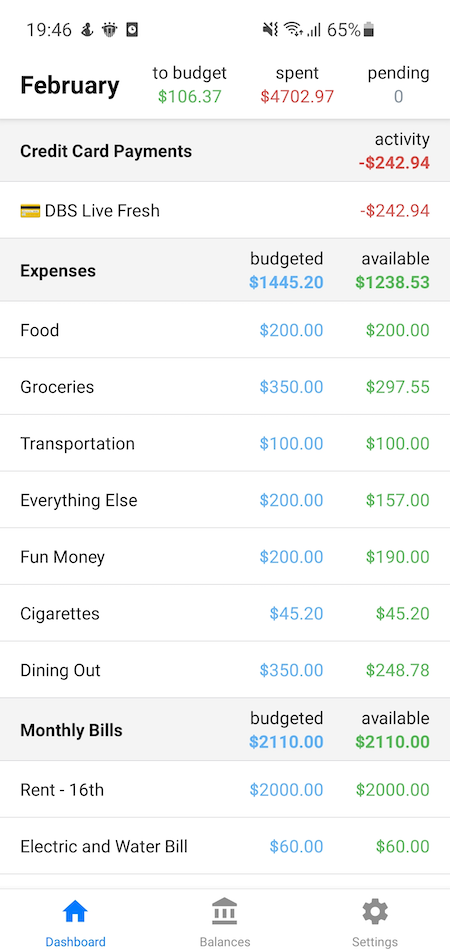
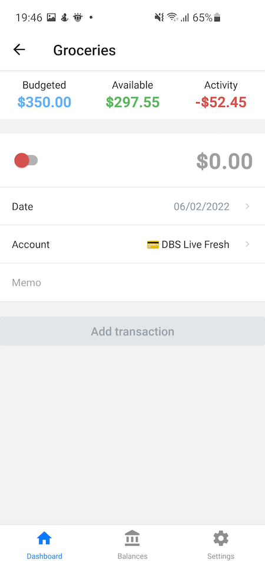
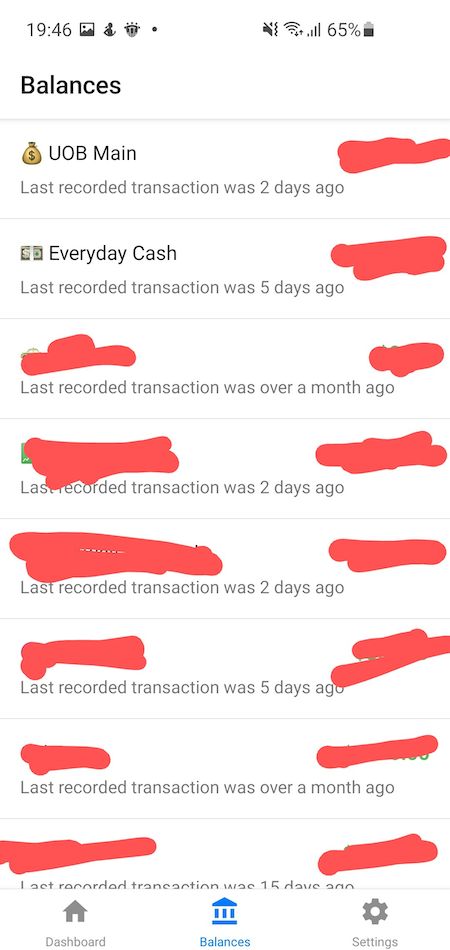

# Aspire budgeting mobile

A simple mobile app to work with [aspire budgeting spreadsheet](https://aspirebudget.com/).

### Screenshots





### Development

1. Obtain Google API keys for [Auth](https://docs.expo.dev/guides/authentication/#google) and [Sheets API](https://developers.google.com/sheets/api/guides/authorizing).
2. Install dependencies: `yarn`
3. Modify `app.json` by replacing values of `apiKey` and `certificateHash` fields with your own keys for Sign-in with Google.
4. Create `.env` file with the following content to access Sheets API:
```
ANDROID_CLIENT_ID=<your client id>
ANDROID_STANDALONE_CLIENT_ID=<your client id>
```
4. Start development server: `yarn start`
5. Use [Expo](https://docs.expo.dev/) client to run it on your mobile.
